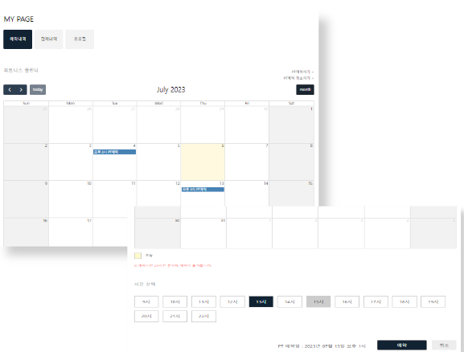
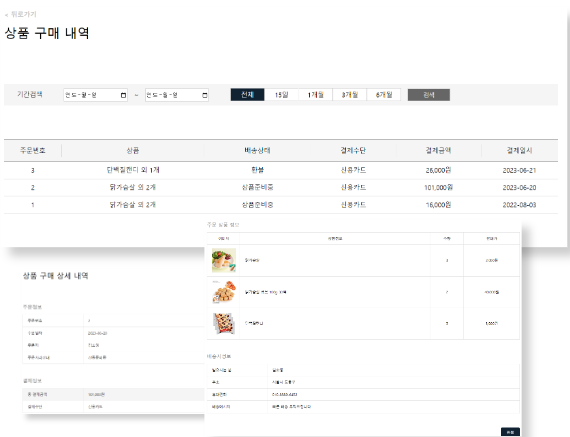
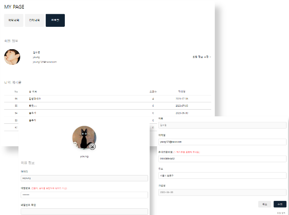
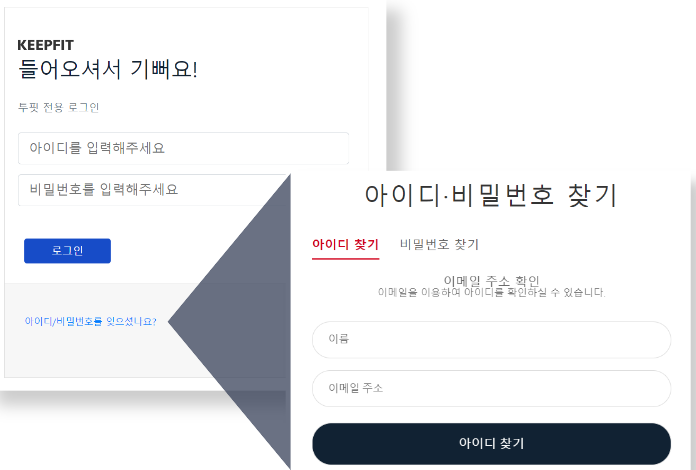
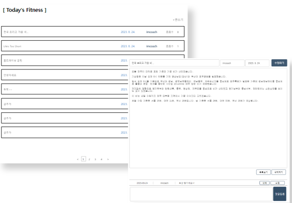
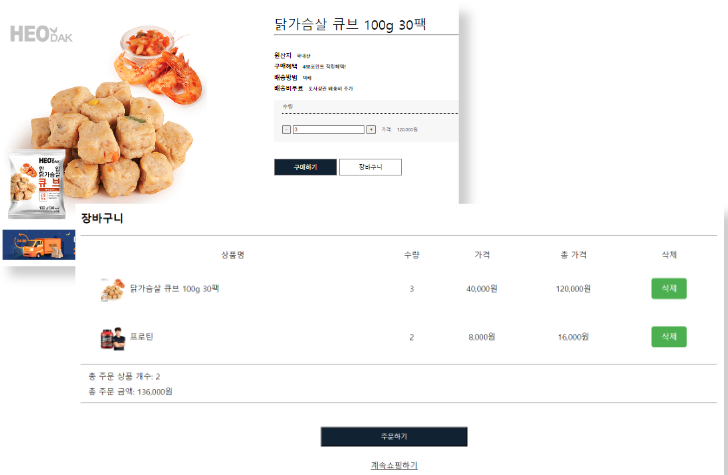
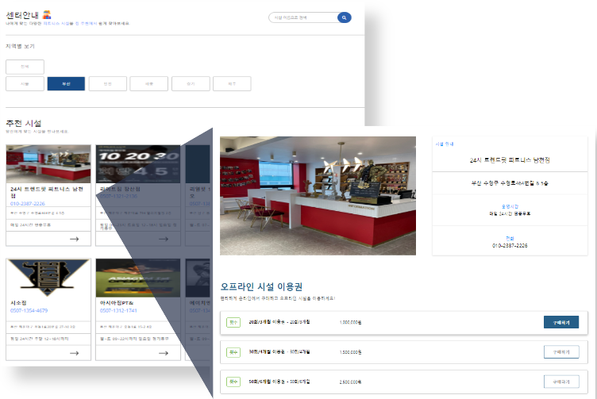
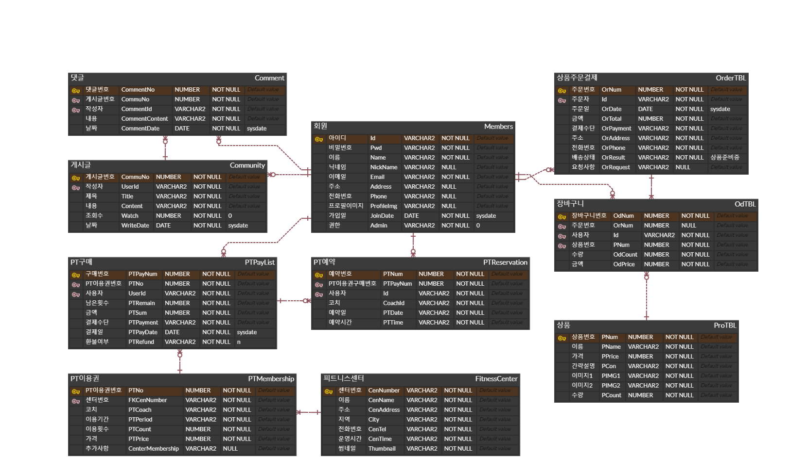

# TOFIT 💪🏻
**TOFIT**은 직접 PT를 받으며 불편했던 경험을 바탕으로 제작한 PT 일정 관리 및 헬스케어 통합 플랫폼입니다. 
이 프로젝트의 주목적인 PT 예약관리를 위해 PT 일정을 캘린더 형식으로 확인할 수 있으며, PT 예약 및 취소 기능을 제공합니다.
TOFIT에서 제공하는 피트니스 센터 및 PT 이용권 정보와 함께 PT 이용권을 구매할 수 있고, 구매한 PT 이용권을 바탕으로 PT 일정을 관리할 수 있습니다.
그 외에 헬스 식품을 구매할 수 있으며, 게시판 기능을 통해 헬스 커뮤니티를 형성할 수 있습니다.

 

## 팀과 나의 역할
+ 팀장을 맡아 주제 선정부터 일정 조율까지 프로젝트 및 팀원을 관리
+ PT일정 예약 및 확인이 가능하고 결제내역과 개인정보 프로필을 확인할 수 있는 마이페이지의 백엔드/프론트 개발
+ 팀원의 도움 요청 또는 결원으로 헬스 식품 쇼핑몰 페이지와 제휴 피트니스 센터 페이지 백엔드 개발

🐱 **김소영 - 마이페이지(백엔드 + 프론트엔드), 쇼핑몰(백엔드), 피트니스 센터(백엔드)** 
🐻 김용삼 - 로그인, 회원가입(백엔드 + 프론트엔드) 
🐥 박주희 - 게시판(백엔드 + 프론트엔드) 
🐹 윤소라 - 게시판(백엔드), PPT 
🦊 정재화 - 쇼핑몰(백엔드 + 프론트엔드), PPT 
🐻‍❄️ 이창환 - 피트니스 센터(프론트엔드) 

 

## 주요 기능
상세 내용은 [이곳](https://drive.google.com/file/d/1nPzn8VZ4Mn9JVav-i1BKRrlVWryThBoM/view?usp=sharing "TOFIT 포트폴리오")에서 확인하세요.
#### Mypage
+ PT 일정 확인, PT 예약 및 취소, PT 이용권 조회 및 환불, 상품 구매내역 조회 및 환불, 작성한 게시글 조회, 본인확인, 회원정보 조회 및 수정, 회원 탈퇴
  

  
PT 일정 관리

  

  
  

  

  

  
구매내역 조회

  

  
  

  

  

  
회원정보 조회

  

  
  

  

#### Member
+ 회원가입, 로그인, 로그아웃, 아이디/비밀번호 찾기
  

  
로그인

  

  
  

  

#### Community
+ 게시판 조회, 게시글 CRUD, 조회, 댓글 CRUD
  

  
게시판 조회

  

  
  

  

#### Shop
+ 헬스식품 조회, 구매 수량 설정 및 바로구매, 장바구니 CRUD
  

  
상품 조회 및 장바구니

  

  
  

  

#### FitnessCenter
+ 피트니스 센터 조회(센터 이름 검색, 지역별 검색), 피트니스 센터별 PT 이용권 조회 및 구매
  

  
피트니스 센터 조회

  

  
  

  

  
 

## ERD

 

## 개발 환경
+ Backend: Java, Spring, MyBatis, Oracle DB, Maven
+ Frontend: HTML5, CSS3, JavaScript, jQuery
+ Dev Tools: Eclipse, Github, Figma
